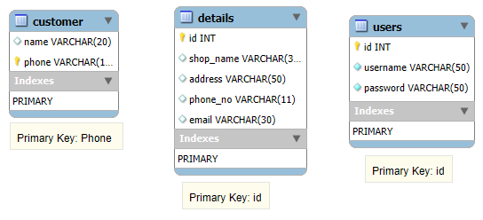

# Tailor-Management-System
# Day 1
Created Login page and connected Database for communication
# Queries are required to work with Database
CREATE TABLE users (id INT AUTO_INCREMENT PRIMARY KEY,
                    username VARCHAR(50) NOT NULL,
                    password VARCHAR(50) NOT NULL);

insert into users (username, password) values ('Your Name', 'Your Password');

# Day 2
Work on backend classes (Shirt, Pant, Coat, Shalwar Kameez) measurements.
still remaining to connect with database and business logic.

# Day 3
Work on totally frontend classes and confused about the design strategy.
So, tomorrow will work on backend in the end work on fronted

# Day 4
Work on frontend and added side bar and landing page.
Added event handing and clear field functionality.

# Day 5
Worked on frontend and still working on database and backend strategies.

# Queries are required
CREATE TABLE details (
id INT NOT NULL AUTO_INCREMENT PRIMARY KEY,
shop_name VARCHAR(30),
address VARCHAR(50),
phone_no VARCHAR(11),
email VARCHAR(30)
);

create table customer (name varchar(20), phone varchar(11) primary key);